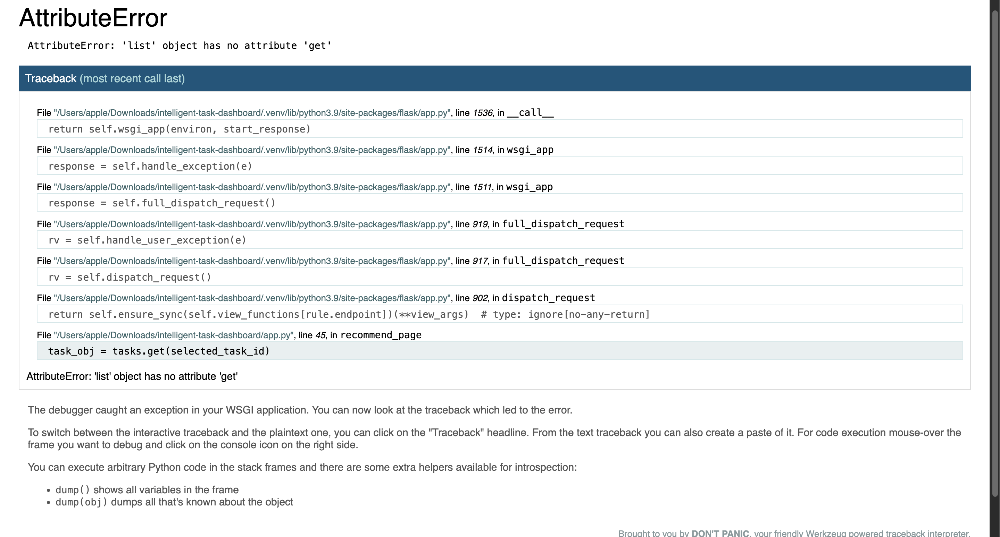
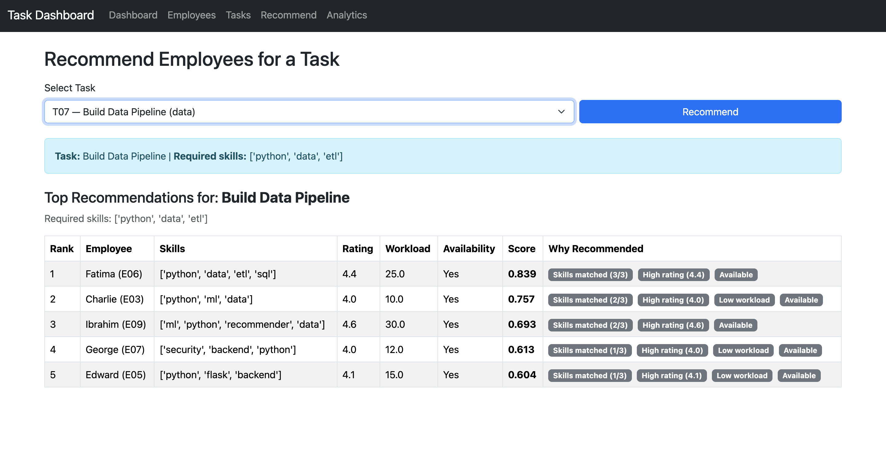

# Explainable AI Resource Allocation Dashboard

An interactive AI-powered dashboard that helps organizations allocate employees
to tasks while clearly explaining **why** each recommendation is made.

This project focuses on **explainable decision support**, not black-box automation.

---

## 🔍 What Does This System Do?

The system:

- Takes a selected **task**
- Evaluates available **employees**
- Recommends the **Top-K best candidates**
- Explains each recommendation using:
  - Skill match
  - Workload
  - Availability

All explanations are shown **visually** and in **natural language**.

---
## 🖥️ Dashboard Walkthrough

### Recommendations Panel
Employees are ranked by suitability score for the selected task.  
Each recommendation card is **clickable** and updates the explanation panels to help you compare trade-offs.



---

### Explainability Panels
Selecting a recommended employee updates all explanation views in real time:

- **Score Breakdown** — contribution of skill match, workload, and availability  
- **Skill Fit Radar** — employee skills vs task requirements  
- **Why this employee?** — human-readable explanation supporting trust  



---

## 🧠 Why This Is Explainable AI

Instead of only showing a final score, the system exposes:

- Individual factor contributions
- Trade-offs between skill match and workload
- Human-readable reasoning

This allows users to:

- Trust the recommendation
- Compare alternatives
- Make informed final decisions

---

## 🧱 System Architecture

The system is designed as a **modular, end-to-end AI application**.

**Flow of data and decisions:**

1. **Web Dashboard (HTML, CSS, JavaScript)**  
   Users select tasks, explore recommendations, and interact with explanations.

2. **Flask REST API**  
   Serves tasks, employees, and allocation results via clean endpoints.

3. **Allocation & Scoring Logic**  
   Computes suitability scores using skill match, workload, and availability,
   while preserving explainable component contributions.

4. **SQLite Database**  
   Stores tasks, employees, workloads, and related data.

This architecture separates concerns between presentation, logic, and data,
making the system extensible and research-friendly.

> This is a full end-to-end AI system, not just a script or notebook.

---

## 🛠️ Tech Stack

**Frontend**
- HTML
- CSS
- JavaScript
- Chart.js

**Backend**
- Python
- Flask (REST API)

**Database**
- SQLite

---

## 🚀 How to Run the Project

```bash
git clone https://github.com/BEZZARRANYA/explainable-resource-allocation.git
cd explainable-resource-allocation
python -m venv .venv
source .venv/bin/activate
pip install -r requirements.txt
python db/init_db.py
python app.py

